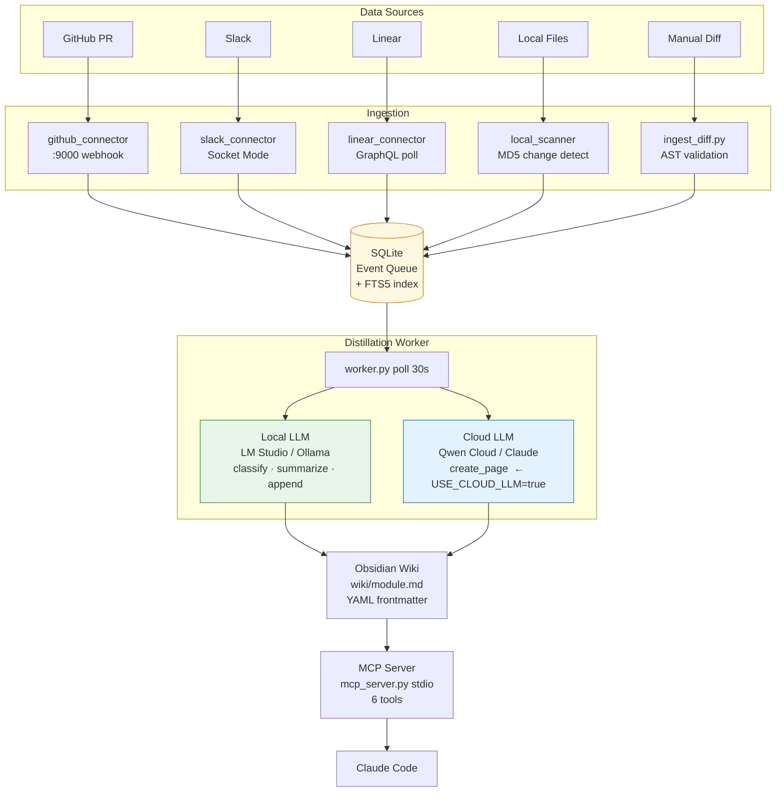

# Shadow Wiki

> A self-updating technical wiki that turns GitHub PRs, Slack conversations, Linear tickets, and local code changes into a searchable, structured knowledge base — automatically.

Shadow Wiki runs a hybrid local/cloud LLM pipeline that watches your team's activity streams, distills them into module-level Obsidian wiki pages, and exposes everything as a FastMCP server so Claude Code can query your codebase context without scanning files.

---

## The Problem

Developer knowledge lives in too many places at once: PR descriptions, Slack threads, Linear comments, code commits. New engineers spend days reconstructing context. Senior engineers re-explain the same architecture decisions repeatedly. Documentation is always out of date because writing it is manual work nobody has time for.

## What Shadow Wiki Does

- **Watches** GitHub PRs, Slack channels, Linear tickets, and local file changes
- **Distills** each event through a local Qwen model (free, private, fast) — classifies which code modules are affected, summarises the change, appends it to the right wiki page
- **Creates** new wiki pages via a cloud model (Qwen Cloud / Claude / DeepSeek) only when a module is seen for the first time — so cloud cost stays near zero
- **Exposes** the entire wiki as a FastMCP server, letting Claude Code call `search_wiki("redis session")` instead of grepping thousands of files

---

## Architecture



---

## Quick Start

**Prerequisites:** Python 3.12, [uv](https://docs.astral.sh/uv/), and either [LM Studio](https://lmstudio.ai) or [Ollama](https://ollama.com) with a Qwen 3 model loaded.

```bash
# 1. Clone and install
git clone https://github.com/thomaschen-tw/shadow-wiki.git && cd shadow-wiki
uv sync                                    # Python 3.12 venv + all deps

# 2. Configure
cp .env.example .env                       # fill in your tokens
uv run python test_env.py                  # verify environment before starting

# 3. One-command demo
bash demo.sh                               # init → worker → push test diff → show wiki output
```

Or step by step:

```bash
uv run python scripts/resource_mgr.py init          # initialise database
uv run python scripts/distill/worker.py &           # start distillation worker
uv run python scripts/ingest_diff.py --diff - \
  --pr 1 --title "Add login" <<< "+def login(): pass"   # push a diff
uv run python scripts/resource_mgr.py list          # see indexed modules
```

---

## Configuration

All settings live in `.env`. Copy `.env.example` to get started.

### LLM Backends

| Variable | Default | Options |
|---|---|---|
| `LOCAL_LLM_BACKEND` | `auto` | `auto` · `lmstudio` · `ollama` |
| `CLOUD_LLM_BACKEND` | `claude` | `claude` · `qwen_cloud` · `deepseek` |
| `USE_CLOUD_LLM` | `false` | `false` = 100% local; `true` = cloud for new pages |
| `LLM_TIMEOUT` | `300` | seconds |
| `ENABLE_THINKING` | `false` | Qwen3 chain-of-thought on/off |

`auto` probes LM Studio on `localhost:1234` first, then Ollama on `localhost:11434`.

**Cost profile:** 99% of events use the local model (free). Cloud is called only when a brand-new wiki module needs to be created from scratch.

### Toggle Buttons (CLI)

```bash
uv run python scripts/resource_mgr.py cloud on   # enable cloud LLM for new pages
uv run python scripts/resource_mgr.py cloud off  # all local (default)
uv run python scripts/resource_mgr.py db on      # local SQLite (default)
uv run python scripts/resource_mgr.py db off     # switch to DATABASE_URL
uv run python scripts/resource_mgr.py dev        # free RAM + pause Docker
uv run python scripts/resource_mgr.py compile    # load model + resume Docker
```

### Data Sources

| Source | Variable(s) | Setup |
|---|---|---|
| GitHub | `GITHUB_TOKEN`, `GITHUB_WEBHOOK_SECRET` | [docs/github-setup.md](docs/github-setup.md) |
| Slack | `SLACK_BOT_TOKEN`, `SLACK_APP_TOKEN`, `SLACK_CHANNELS` | Enable Socket Mode in Slack app settings |
| Linear | `LINEAR_API_KEY` | Settings → API → Personal keys |
| Local files | `LOCAL_SCAN_PATHS`, `LOCAL_SCAN_EXTENSIONS` | No external setup |

All data sources are **optional**. Shadow Wiki works with just manual diff ingestion.

---

## Claude Code MCP Integration

Add to `~/.claude/claude.json`:

```json
{
  "mcpServers": {
    "shadow-wiki": {
      "command": "uv",
      "args": ["run", "python", "/absolute/path/to/shadow-wiki/scripts/mcp_server.py"]
    }
  }
}
```

Available tools in Claude Code:

```
search_wiki("redis session token")          → FTS5 search across all wiki content
get_module("auth/session")                  → full markdown + frontmatter for a module
list_modules(tag="redis")                   → browse all indexed modules
get_recent_changes("7d")                    → what changed in the last 7 days
update_module("auth/session", "Known Issues", "- token refresh race condition")
get_pipeline_status_tool()                  → queue health: pending / failed / last run
```

---

## Project Structure

```
shadow-wiki/
├── scripts/
│   ├── config.py               ← all settings from .env (pydantic-settings)
│   ├── db.py                   ← SQLite: event queue, module index, FTS5 search
│   ├── distill/
│   │   ├── llm_router.py       ← routes tasks to local vs cloud LLM
│   │   ├── prompts.py          ← system prompts for each task type
│   │   └── worker.py           ← event consumption loop (run as daemon)
│   ├── ingest/
│   │   ├── github_connector.py ← Flask webhook server (port 9000)
│   │   ├── slack_connector.py  ← Slack Socket Mode listener
│   │   ├── linear_connector.py ← Linear GraphQL poller (every 5 min)
│   │   └── local_scanner.py    ← MD5-based file change detector
│   ├── wiki/
│   │   └── manager.py          ← read/write Obsidian .md with YAML frontmatter
│   ├── mcp_server.py           ← FastMCP stdio server (6 tools for Claude Code)
│   ├── ingest_diff.py          ← CLI: push diff manually + AST syntax validation
│   └── resource_mgr.py         ← CLI: init / status / list / cloud / db / dev
├── tests/                      ← 48 tests
├── wiki/                       ← generated Obsidian pages (committed as living docs)
├── docs/
│   ├── SOP.md                  ← full setup and operations guide
│   ├── architecture.md         ← ASCII + Mermaid architecture diagrams
│   └── github-setup.md         ← step-by-step GitHub webhook setup
├── demo.sh                     ← one-command MVP demo
├── test_env.py                 ← environment checker (connectivity + credentials)
├── .env.example                ← config template
└── pyproject.toml              ← uv project file, Python 3.12, deps
```

---

## Running Tests

```bash
uv run pytest -v
```

48 tests covering config loading, SQLite operations, FTS5 search, wiki manager, LLM routing, all connectors, MCP tools, and an end-to-end integration test.

---

## Docs

| Document | Contents |
|---|---|
| [docs/SOP.md](docs/SOP.md) | Full setup, configuration, operations, troubleshooting |
| [docs/architecture.md](docs/architecture.md) | ASCII + Mermaid diagrams, data flow walkthrough |
| [docs/github-setup.md](docs/github-setup.md) | GitHub token, webhook, ngrok for local dev |

---

## Tech Stack

- **Python 3.12** — managed by [uv](https://docs.astral.sh/uv/)
- **FastMCP** — MCP server (stdio mode)
- **SQLite + FTS5** — event queue and full-text search (trigram tokeniser)
- **pydantic-settings** — `.env`-driven configuration
- **openai SDK** — OpenAI-compatible client for LM Studio, Ollama, Qwen Cloud, DeepSeek
- **anthropic SDK** — Claude API
- **Flask** — GitHub webhook receiver
- **slack-sdk** — Slack Socket Mode
- **python-frontmatter** — Obsidian YAML frontmatter read/write
