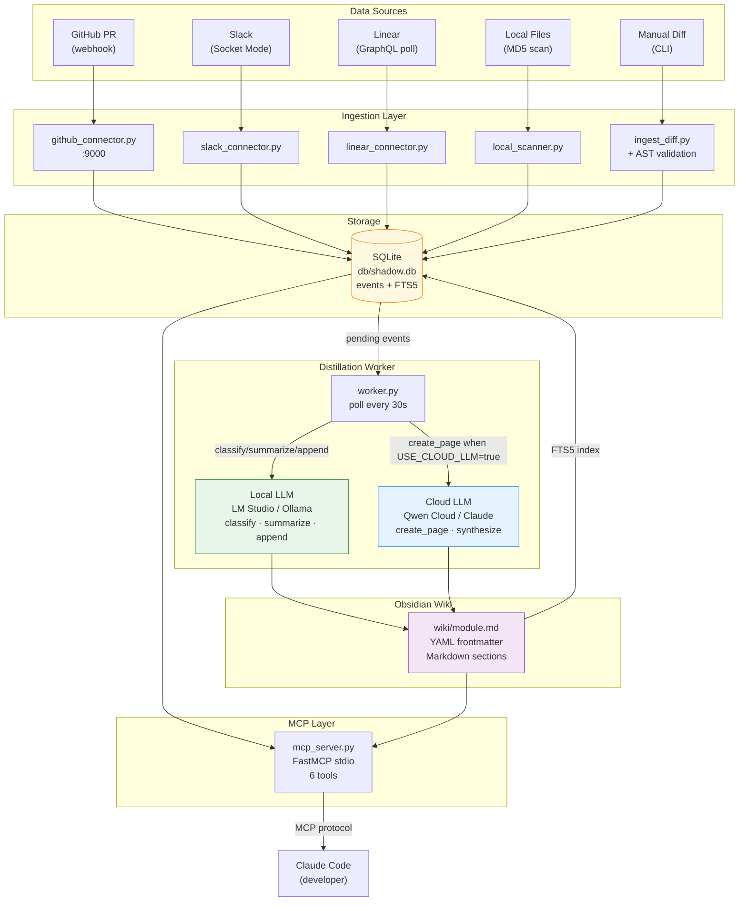

# Shadow Wiki — Architecture

## System Overview

```
┌───────────────────────────────────────────────────────────────────────┐
│                          DATA SOURCES                                 │
│                                                                       │
│  GitHub PR/Review   Slack Messages   Linear Tickets   Local Files     │
│  (webhook :9000)    (Socket Mode)    (GraphQL poll)   (MD5 scan)      │
└────────┬───────────────┬─────────────────┬────────────────┬───────────┘
         │               │                 │                │
         ▼               ▼                 ▼                ▼
┌───────────────────────────────────────────────────────────────────────┐
│                       INGESTION LAYER                                 │
│  github_connector.py  slack_connector.py  linear_connector.py        │
│  ingest_diff.py (CLI + AST syntax validation gate)                   │
│  local_scanner.py                                                     │
└─────────────────────────────┬─────────────────────────────────────────┘
                               │  push_event()
                               ▼
┌───────────────────────────────────────────────────────────────────────┐
│                     SQLITE EVENT QUEUE  db/shadow.db                  │
│                                                                       │
│  events      status: pending → processing → done | failed            │
│  modules     path, summary, last_updated                              │
│  wiki_fts    FTS5 trigram full-text search index                      │
│  file_hashes MD5 hashes for change detection                         │
└─────────────────────────────┬─────────────────────────────────────────┘
                               │  get_pending_events()  [poll 30s]
                               ▼
┌───────────────────────────────────────────────────────────────────────┐
│                   DISTILLATION WORKER  worker.py                      │
│                                                                       │
│  1. CLASSIFY  → which modules affected?                               │
│  2. SUMMARIZE → structured change summary                             │
│  3. For each module:                                                  │
│     • New module   → CREATE_PAGE  ─────────────────────┐             │
│     • Existing     → APPEND       ──────────┐          │             │
│                                             ▼          ▼             │
│  ┌──────────────────────────┐   ┌────────────────────────────────┐  │
│  │  LOCAL LLM  (high-freq)  │   │  CLOUD LLM  (low-freq)         │  │
│  │  LM Studio / Ollama      │   │  Qwen Cloud / Claude / DeepSeek│  │
│  │  classify, summarize,    │   │  create_page, synthesize        │  │
│  │  append, query           │   │  (only when USE_CLOUD_LLM=true) │  │
│  └──────────────────────────┘   └────────────────────────────────┘  │
└─────────────────────────────┬─────────────────────────────────────────┘
                               │  write .md files
                               ▼
┌───────────────────────────────────────────────────────────────────────┐
│                   OBSIDIAN WIKI  wiki/{module}.md                     │
│                                                                       │
│  YAML frontmatter: module, last_updated, recent_prs, owners,         │
│                    known_issues, slack_threads, tags                  │
│                                                                       │
│  Sections: ## Overview  ## Recent Changes  ## Known Issues           │
│            ## Related Modules                                         │
└─────────────────────────────┬─────────────────────────────────────────┘
                               │
                               ▼
┌───────────────────────────────────────────────────────────────────────┐
│                   MCP SERVER  mcp_server.py  (stdio)                  │
│                                                                       │
│  search_wiki(query)          get_module(path)                        │
│  list_modules(tag)           get_recent_changes(since)               │
│  update_module(path,section) get_pipeline_status_tool()              │
└─────────────────────────────┬─────────────────────────────────────────┘
                               │  MCP protocol
                               ▼
                    ┌─────────────────────┐
                    │     Claude Code      │
                    │  (developer terminal)│
                    └─────────────────────┘
```

---

## Mermaid Diagram



---

## Toggle Reference

| Toggle | Default | Command | Effect |
|--------|---------|---------|--------|
| `USE_LOCAL_DB` | `true` | `resource_mgr.py db on\|off` | `on` = SQLite; `off` = `DATABASE_URL` |
| `USE_CLOUD_LLM` | `false` | `resource_mgr.py cloud on\|off` | `off` = all local; `on` = cloud for new pages |
| `LOCAL_LLM_BACKEND` | `auto` | edit `.env` | `auto` → probe LM Studio → Ollama |
| `CLOUD_LLM_BACKEND` | `claude` | edit `.env` | `claude \| qwen_cloud \| deepseek` |
| `ENABLE_THINKING` | `false` | edit `.env` | Qwen3 chain-of-thought on/off |

---

## Data Flow (single PR event)

```
1. GitHub webhook fires → github_connector queues event in SQLite
2. worker.py wakes (every 30s) → picks up event
3. call_llm(CLASSIFY)  → local Qwen → ["auth/session", "api/users"]
4. call_llm(SUMMARIZE) → local Qwen → {summary, change_type, …}
5. For "auth/session":
   a. module_exists? No → call_llm(CREATE_PAGE) → write wiki/auth/session.md
   b. module_exists? Yes → call_llm(APPEND) → prepend to ## Recent Changes
6. update_fts() → SQLite FTS5 index refreshed
7. Claude Code calls search_wiki("session token") → MCP returns snippet
```
