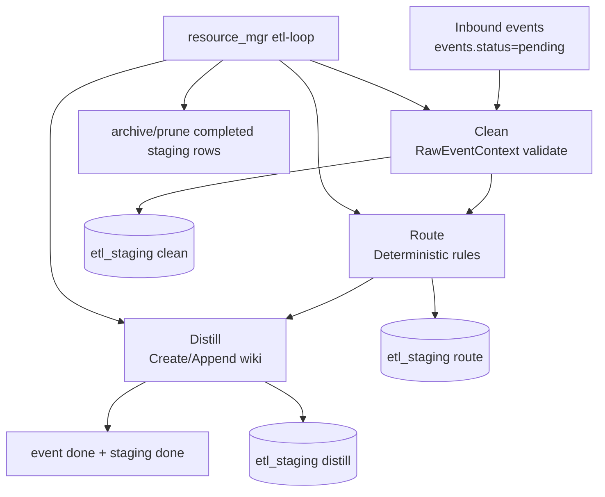

# PulseWiki ETL Data Flow (v1.3)

本文件是 ETL 控制面的官方数据流说明，适用于当前代码实现，不再描述旧版 Bash 循环调度与 Route 阶段 LLM 分类。

关联实现入口：
- [scripts/db.py](../scripts/db.py#L226)
- [scripts/distill/worker.py](../scripts/distill/worker.py#L139)
- [scripts/resource_mgr.py](../scripts/resource_mgr.py#L296)
- [scripts/start_etl_stack.sh](../scripts/start_etl_stack.sh)

## 1. 架构总览

在 v1.3 中：
- [scripts/start_etl_stack.sh](../scripts/start_etl_stack.sh) 只负责拉起进程和日志监控。
- 自适应调度、背压感知、批大小与休眠调整全部由 [scripts/resource_mgr.py](../scripts/resource_mgr.py#L319) 的 `etl-loop` 承担。
- ETL 三阶段为确定性流水：Clean -> Route -> Distill。



## 2. Clean 阶段: 强类型与确定性规范化

实现位置：
- [scripts/distill/worker.py](../scripts/distill/worker.py#L139)

核心行为：
1. 从 `events` 拉取窗口事件或 pending 事件。
2. 将 `raw_json` 解包为对象，并进行输入清洗。
3. 使用 `RawEventContext` 执行 Pydantic 强类型校验。
4. 校验通过后写入 clean 产物；校验失败时标记 staging failed，并可同步标记 event failed（apply 模式）。

字段合同（简化）：
- `event_id`
- `source`
- `event_type`
- `occurred_at`
- `title`
- `description`
- `diff`
- `raw`

这一步的目标是将异构事件源统一为严格、可序列化、可回放的结构化上下文。

## 3. Route 阶段: 显式规则与新模块候选提升

实现位置：
- [scripts/distill/worker.py](../scripts/distill/worker.py#L208)

v1.3 的 Route 是确定性规则匹配，不再调用分类 LLM。

规则示意：
1. 优先使用显式 hint（如 `raw.module_path` 或路径推断）。
2. 命中关键字规则（如 auth/session）。
3. 默认回退到 `general`。

关键变化：
- 当规则给出非 `general` 目标但模块尚不存在时，不再直接塌陷到 `general`。
- 系统将其提升为新模块候选，写入 route 元信息：
  - `candidate_new_module=true`
  - `fallback_reason=module_not_found_candidate`
  - `rule_source` 追加 `promote:new_module_candidate`

Route 输出合同（RouteDecision）包含：
- `module_path`
- `section`
- `entry`
- `pr_ref`
- `source_meta`
- `fallback_reason`
- `rule_source`
- `target_exists`
- `candidate_new_module`

## 4. Distill 阶段: 新模块创建机会与写入

实现位置：
- [scripts/distill/worker.py](../scripts/distill/worker.py#L268)

核心行为：
1. 若 `module_path` 不存在，进入 `_create_module_for_etl`。
2. 在 ETL 写目标且开启云模型、且命中新模块候选时，提供 `CREATE_PAGE` 机会。
3. 云端创建失败或不满足条件时，回退到本地 stub 骨架创建。
4. 将路由条目追加到目标 section，标记 `event done` 与 `distill done`。

此机制确保“规则可解释性”与“新模块可生长性”并存。

## 5. Hot Table 治理与 etl-status 口径

实现位置：
- [scripts/db.py](../scripts/db.py#L226)
- [scripts/resource_mgr.py](../scripts/resource_mgr.py#L114)

`etl_staging` 在 v1.3 分为热数据视角与归档视角：
- `get_staging_records(..., hot_only=True)`
- `has_staging_record(..., hot_only=True)`
- `get_staging_status_counts(hot_only=True)`

运维口径说明：
- `etl-status` 当前只统计 hot rows，即 `archived_at IS NULL` 的 staging 记录。
- 已归档或已清理记录不计入 `etl-status` 显示。

## 6. 调度控制面与背压感知

实现位置：
- [scripts/resource_mgr.py](../scripts/resource_mgr.py#L319)

`etl-loop` 每轮读取三个信号：
- `pending`：待处理事件数
- `inflight`：热表中 processing 数
- `recent_failed`：窗口期 failed 数

控制策略：
1. `inflight >= max_inflight` 时进入背压跳过，延迟重试。
2. `recent_failed > 0` 时按失败连击指数退避。
3. 按 `pending` 阶段动态调整 `batch_limit` 与 `sleep`。
4. 每轮运行 `run_etl_once_with_cleanup`，并执行归档/清理。

## 7. 关键命令

```bash
# 启动 ETL 栈（脚本作为进程拉起器）
bash scripts/start_etl_stack.sh

# 自适应循环（dry-run）
uv run python scripts/resource_mgr.py etl-loop --limit 50 --base-sleep 30

# 自适应循环（apply）
uv run python scripts/resource_mgr.py etl-loop --apply --limit 50 --base-sleep 30

# 查看 hot rows 口径状态
uv run python scripts/resource_mgr.py etl-status

# 回放窗口（先 dry-run 再 apply）
uv run python scripts/resource_mgr.py etl-replay --since "2026-06-08 00:00:00" --until "2026-06-08 23:59:59" --limit 200
uv run python scripts/resource_mgr.py etl-replay --since "2026-06-08 00:00:00" --until "2026-06-08 23:59:59" --apply --limit 200
```

## 8. 版本声明

- Doc Version: 2026-06-08
- System Version: PulseWiki v1.3
- Status: Source-of-Truth aligned with implementation
