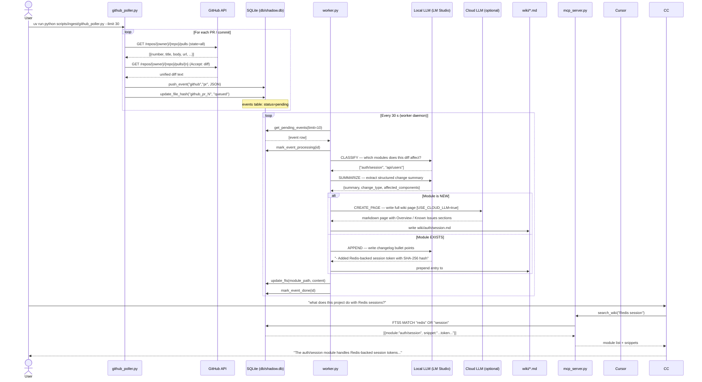
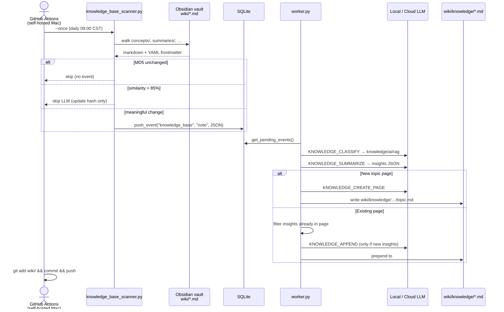

# PulseWiki — Workflow & Data Flow

This document shows exactly how the program runs, what data moves between each component, and what you will find in `raw/` and `wiki/` after running it.

---

## Execution Sequence



---

## Knowledge Base Lane (Obsidian → wiki/knowledge/)

Separate from code events. Scans only `KNOWLEDGE_BASE_PATH` (your vault's `wiki/` folder). Worker dispatches `source=knowledge_base` to `_handle_knowledge_event()`.



**Output shape** (under `wiki/knowledge/`, not `wiki/auth/`):

```
wiki/knowledge/
├── concepts/
│   └── rag-retrieval-augmented-generation.md
├── ai/
│   └── multi-agent.md
└── tools/
    └── obsidian.md
```

Sections: **Overview**, **Key Concepts**, **Key Insights**, **Sources**, **Related Topics** — not Recent Changes / Known Issues.

---

## What You See After Running

### `raw/` — Raw event backups

Written only by `ingest_diff.py` (manual CLI). Each file is a timestamped markdown snapshot:

```
raw/
└── commit_1748423000.md
```

```markdown
---
title: Add Redis session management
time: 2026-05-28 14:20:00
confidence: 0.95
ast_validated: true
reason: "Python syntax OK"
---

```diff
+def create_session(user_id: str) -> str:
+    token = hashlib.sha256(...)
```
```

> **Note:** The GitHub poller and webhook do **not** write to `raw/`. Only `ingest_diff.py --diff` does.

---

### `wiki/` — LLM-generated Obsidian pages

One `.md` file per code module the LLM identifies. After processing 30 PRs from a Python project you might see:

```
wiki/
├── auth/
│   └── session.md
├── api/
│   └── users.md
├── scripts/
│   ├── config.md
│   ├── db.md
│   └── distill/
│       └── worker.md
└── general.md          ← fallback if LLM can't classify
```

Each file has **YAML frontmatter** and **four sections**:

```markdown
---
module: auth/session
last_updated: '2026-05-28'
recent_prs: ['#12', '#18', '#23']
owners: ['alice', 'bob']
known_issues: []
slack_threads: []
tags: ['redis', 'auth', 'session']
---

## Overview

The `auth/session` module implements Redis-backed session management...
- `create_session(user_id)` → SHA-256 token, stored in Redis with 1-hour TTL
- `validate_session(token)` → returns user_id or None

## Recent Changes

**2026-05-28 · PR #23**
- Switched session store from in-memory dict to Redis for horizontal scaling
- Added configurable TTL via SESSION_TTL_SECONDS env var

**2026-05-20 · PR #18**
- Fixed token collision race condition under concurrent login load

## Known Issues

*(none recorded yet)*

## Related Modules

- api/users — calls create_session after successful login
- infra/redis — provides the Redis client used here
```

---

## Running the Full Demo With Your GitHub Repo

You have `thomaschen-tw/pulse-wiki` with 30+ commits. Here is the exact sequence:

```bash
# Step 1 — verify your token and repo are configured
uv run python test_env.py
# Expect: [PASS] GitHub token valid — authenticated as @thomaschen-tw

# Step 2 — init DB and start worker in background
uv run python scripts/resource_mgr.py init
uv run python scripts/distill/worker.py &

# Step 3 — pull all PRs and commits from your repo (no webhook needed)
uv run python scripts/ingest/github_poller.py --limit 30 --commits

# Step 4 — watch the worker log — it processes events within 30 s
# Each event logs:  INFO Event N done

# Step 5 — check results
uv run python scripts/resource_mgr.py status
uv run python scripts/resource_mgr.py list

# Step 6 — browse the wiki
ls wiki/
cat wiki/scripts/config.md    # example — depends on what LLM classifies
```

Expected terminal output during processing:

```
2026-05-28 14:30:00 INFO GitHub poller started  repo=thomaschen-tw/pulse-wiki  limit=30
2026-05-28 14:30:01 INFO Queued PR #1: feat: uv + Python 3.12 setup
2026-05-28 14:30:01 INFO Queued PR #2: fix: correct anthropic version pin
...
2026-05-28 14:30:05 INFO Ingested 12 new PRs (0 already seen)
2026-05-28 14:30:05 INFO Ingested 25 new commits (0 already seen)

2026-05-28 14:30:35 INFO Processing 10 events
2026-05-28 14:30:38 INFO Event 1 done        ← classify+summarize took ~3s on local LLM
2026-05-28 14:30:41 INFO Event 2 done
...
```

---

## GitHub Integration Options (Comparison)

| Method | Setup | Works offline | Realtime | Best for |
|---|---|---|---|---|
| **`github_poller.py`** (recommended) | Just set `GITHUB_TOKEN` + `GITHUB_REPO` in `.env` | ✓ (polls on demand) | On schedule | Personal projects, local dev |
| **`github_connector.py`** (webhook) | Register webhook + ngrok/public URL | ✗ (needs internet) | ✓ (instant) | Team servers, production |
| **`ingest_diff.py`** (manual CLI) | Nothing | ✓ | Manual | One-off testing |

**For your use case (personal repo, local machine) → use `github_poller.py`.**

---

## Data Flow Map

```
GITHUB API
    │
    │  GET /repos/{owner}/{repo}/pulls   (PRs with diffs)
    │  GET /repos/{owner}/{repo}/commits (commit messages + patches)
    ▼
github_poller.py
    │
    │  push_event("github", "pr"|"commit", {diff, title, author, ...})
    │  update_file_hash("github_pr_N", "queued")   ← dedup key
    ▼
db/shadow.db  ──────────────── events table
    │                           ├── id
    │                           ├── source = "github"
    │                           ├── event_type = "pr"
    │  get_pending_events()      ├── raw_json = "{diff, title, ...}"
    │                           ├── status = pending → processing → done
    ▼                           └── created_at, processed_at
worker.py
    │
    ├──► call_llm(CLASSIFY)  ──► LM Studio  ──► ["auth/session", "scripts/config"]
    ├──► call_llm(SUMMARIZE) ──► LM Studio  ──► {summary, change_type, ...}
    │
    │  For each module_path:
    ├── module_exists(path)?
    │     NO  ──► call_llm(CREATE_PAGE) ──► Cloud LLM [if USE_CLOUD_LLM=true]
    │     YES ──► call_llm(APPEND)      ──► LM Studio  ──► changelog bullets
    │
    ├──► create_module() / append_to_section()
    │       └──► wiki/{module}.md  (YAML frontmatter + markdown sections)
    │
    ├──► update_fts(module_path, content)
    │       └──► db/shadow.db  ── wiki_fts table (FTS5 trigram index)
    └──► mark_event_done(id)

wiki/*.md  ◄─────────────────── human-readable Obsidian pages
    │
    │  read_module(path) + search_modules_fts(query)
    ▼
mcp_server.py  (FastMCP stdio)
    │
    │  MCP protocol (JSON-RPC over stdio)
    ▼
Cursor

---

## Knowledge Base Data Flow

```
Obsidian vault  (local Mac only — KNOWLEDGE_BASE_PATH)
    wiki/concepts/*.md
    wiki/summaries/*.md
         │
         │  MD5 gate → similarity gate (>85% skip)
         ▼
knowledge_base_scanner.py
         │
         │  push_event("knowledge_base", "note", {content, title, wiki_category, …})
         ▼
db/shadow.db  events (source=knowledge_base)
         │
         ▼
worker.py  _handle_knowledge_event()
         │
         ├──► KNOWLEDGE_CLASSIFY  → paths like knowledge/concepts/rag
         ├──► KNOWLEDGE_SUMMARIZE → {insights, key_concepts, tags}
         │
         ├── module_exists?
         │     NO  → KNOWLEDGE_CREATE_PAGE → wiki/knowledge/…/slug.md
         │     YES → filter duplicate insights → KNOWLEDGE_APPEND → ## Key Insights
         │
         └──► update_fts()

wiki/knowledge/*.md  →  MCP search_wiki / Cursor
```
